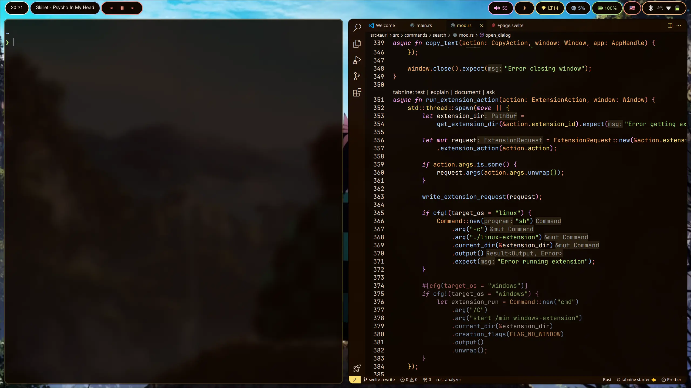

# About
> [!NOTE]
> This is still a WIP 





## Dependencies
Arch:
```sh
sudo pacman -S hyprland hyprpaper xdg-desktop-portal-hyprland gnome-keyring waybar pamixer mako
```

## Move Configs
```
mkdir -p ~/.config/hypr
git clone https://github.com/lighttigerXIV/hyprdots.git ~/.config/hypr/.
cd ~/.config/hypr
mv waybar ~/.config/
mv mako ~/.config/
```
